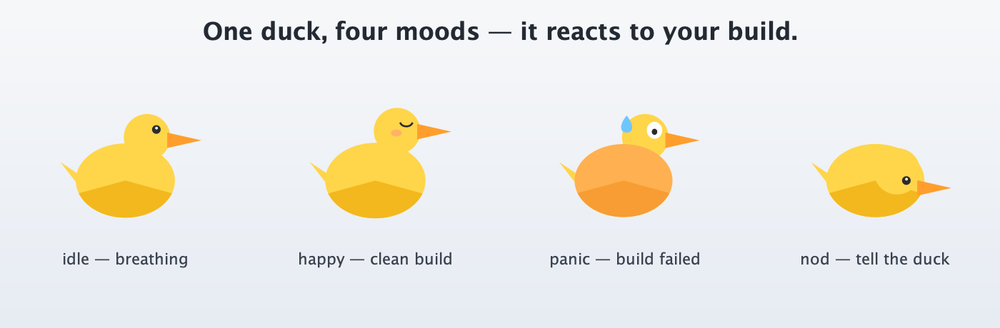
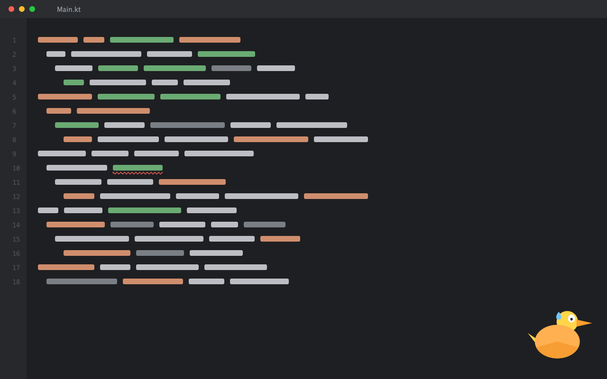
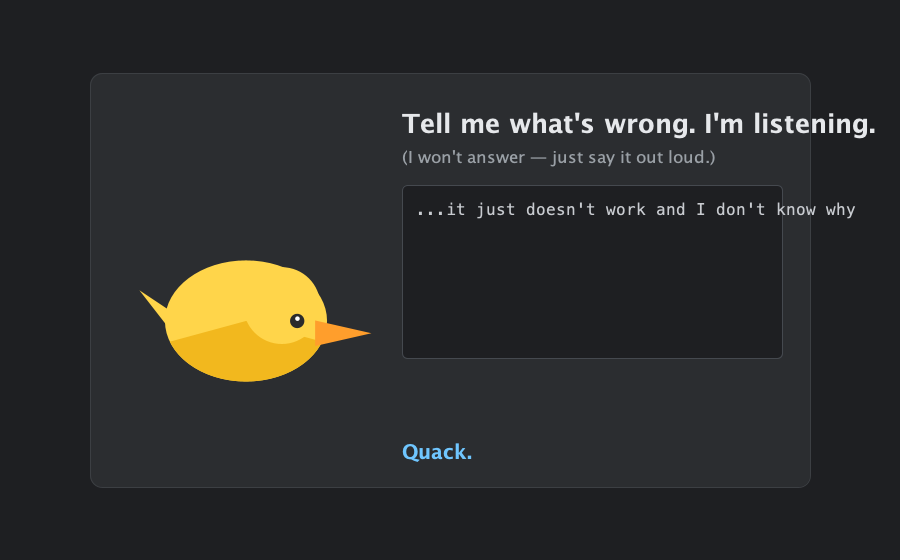
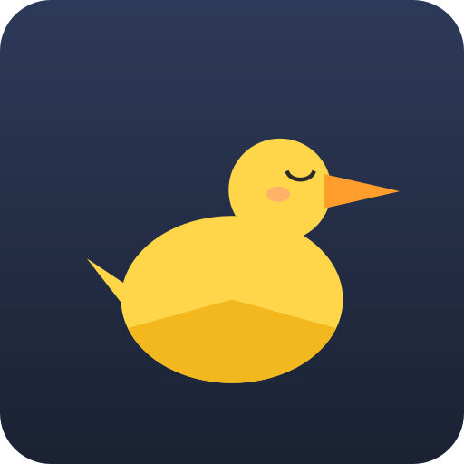

# Rubber Duck Buddy — JetBrains IDE plugin

A rubber duck floats in the **corner of your editor** and reacts with its "face" to the state of
your project. It sits quietly while you work, **panics** on a failed build, **cheers up** on a
clean one, and **nods** when you tell it what's wrong. Zero usefulness, maximum delight — that's
the point.

The duck never reads, analyses, or answers your problem. Saying it out loud is what helps. This
is rubber-duck debugging, made literal.

## Screenshots

> These are procedurally-rendered previews (same duck as in the IDE), generated by
> `marketing/gen/DuckImageGen.java`. The image files live in [`marketing/`](marketing/).

The four moods — only **panic** and **nod** animate; **idle** and **happy** are static:



The duck glued to the editor corner, panicking after a broken build:



The "Tell the Duck" ritual popup (Ctrl+Alt+D) — it nods, then quacks, and ignores what you typed:



Plugin avatar:



## Stack

- Kotlin, JDK 21
- IntelliJ Platform Gradle Plugin **2.x** (`org.jetbrains.intellij.platform`)
- Target IDE: IntelliJ IDEA Community — version pinned in `gradle.properties` (`platformVersion`)
- Swing UI; new UI supported

## Architecture (three independent modules around one service)

`DuckMoodService` (project-level light service) holds the current `Mood`
(`IDLE | HAPPY | PANIC | NOD`). Module 2 writes it; Modules 1 & 3 read it and repaint. Mood
changes are published on the project message bus, always on the EDT.

- **Module 1 — where it lives** (`overlay/`): `DuckOverlay` paints the duck on the IDE glass pane
  via a `Painter` bound to `editor.contentComponent`, so geometry is in editor coordinates and
  clipping is free. It pins to the bottom-right corner of the viewport (Clippy-style) and
  re-pins on scroll/resize. The frame timer runs **only** for animated moods (panic/nod); idle
  and happy are drawn as a single static frame, so an idle duck costs no CPU. `DuckClickArea`
  catches clicks via a glass-pane mouse preprocessor, consuming only presses inside the duck's
  silhouette — everything else passes through to the IDE.
- **Module 2 — what sets the mood** (`mood/`): `CompilationMoodSource` (errors → PANIC, clean →
  HAPPY → IDLE) and `WolfMoodSource` (polls `WolfTheProblemSolver` for live problems → PANIC/IDLE).
- **Module 3 — the ritual** (`ritual/`): `TellTheDuck` shows a light popup with a big duck and a
  text box; the duck NODs as you type and lets out a silent "Quack." The text is discarded.

The duck art is drawn procedurally (`render/DuckRenderer`) — HiDPI-perfect placeholders with no
asset loading. Swap that one class for an image-backed renderer when real sprites arrive.

## Build & run

```bash
export JAVA_HOME=/Library/Java/JavaVirtualMachines/jdk-21.jdk/Contents/Home

./gradlew runIde        # launch a sandbox IDE with the plugin
./gradlew buildPlugin   # produce build/distributions/rubber-duck-*.zip
```

### Try it

1. Open a file — the duck sits in the editor corner, still.
2. Break the syntax and run a build (Build → Build Project) — the duck panics and shakes.
3. Fix it — once the problems clear, the duck calms back down and goes still.
4. Click the duck (or press **Ctrl+Alt+D**) and type — the duck nods, then quacks.

Bump the target IDE by editing `platformVersion` in `gradle.properties`.

## Publishing

See [`DEPLOY.md`](DEPLOY.md) for the JetBrains Marketplace steps. Marketplace metadata
(id `com.mamadra.rubberduck`, name, vendor, change-notes) lives in
`src/main/resources/META-INF/plugin.xml`; the in-IDE icon is `pluginIcon.svg` next to it.
Regenerate the marketing images with `java -Djava.awt.headless=true marketing/gen/DuckImageGen.java marketing`.
